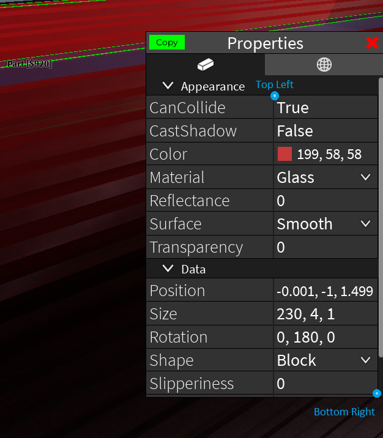
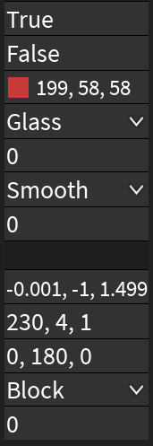

# OC to Studios

Terminal-based tool for scraping Roblox Obby Creator part properties via screenshot+OCR to transfer obbies to Roblox Studios.

Built on Python 3.13.1 in Windows.

## Installation

### In Terminal
```bash
git clone https://github.com/Nicaoaka/oc-to-studios.git
cd oc-to-studios
pip install -r requirements.txt
```
Pytesseract is a wrapper of Google's Tesseract OCR. Go to <a src=https://tesseract-ocr.github.io/tessdoc/Installation.html>Teseract Download Page</a> and download the latest one for your platform.

### Config Setup
Run Obby Creator to see where the properties menu shows up and what appears within it.

In `config.py`, define the screenshot region with the __top-left__ and __bottom-right__ mouse positions of the 'Properties' panel. You can use `print_mouse_position()` to continuously print the mouse position in the terminal at a chosen interval.



The Screenshotted region should look like this:



## Usage

### Set FLIP_AXIS

After loading an obby in Obby Creator. Afterward, open `config.py` and set `FLIP_AXIS = True` if a downward rotation on the red axis (toward the front) results in a positive angle change. Otherwise, if it's negative, set `FLIP_AXIS = False`.

### Running the Program
Run `main.py` in terminal or through any code runner. Most interaction will occur through terminal/console.
```bash
python main.py
```

### Enter Commands

The main flow is `1`, `2`, `3`, `4`, `5`, and `q!`.

    [I]ndex -> [S]ave -> [Q]ueue -> [T]ransfer -> [D]elete -> Quit!

### Default Command Aliases
```
Index Mode                      [1/i]

Save Indexed                    [2/s/si]
Save Queue                      [sq]

Queue Indexed                   [3/q/qi]
Queue a Save file               [qs]
Queue Append Indexed            [qai]
Queue Append a Save file        [qas]

Transfer Mode                   [4/t]

Delete Indexed                  [5/d/di]
Delete New                      [dn]
Delete Queue                    [dq]

Reprint the Commands Menu       [h/help]
Clear Screen                    [cl/clear]
Quit                            [q!]

Cancel Action                   [<ctrl>+c]
```

* Delete clears the contents of the file, but does not remove it.
* Commands are case-insensitive.
* Ctrl+C cancels the current action and returns to the menu.
* Output is colorized using ANSI escape codes.

### Index Mode

    *** Before indexing, make sure the obby can be reverted to how it currently is. ***

Within `config.py`, there are many options related to Index Mode. You will see them in the Index menu along with the keybinds.

### Default Index Mode Settings and Hotkeys

    REGION_TO_SCREENSHOT <Chosen Screen Region>

    FLIP_AXIS            <True or False>

    AUTO_DELETE          False
    AUTO_RESELECT        False
    ADD_PART_MIN_TIME    0.9 (seconds)
    
    PLAY_SOUNDS:         False

    Add a Part           [f]
    Pause                [c]
    Resume               [<ctrl>+e]
    Reprint Menu         [h]
    Exit                 [<ctrl>+c]

* If `HK_EXIT` is rebound to something else, `<ctrl>+c` will not leave Index Mode, only the chosen keybind will.
* Hotkeys are made with pynput, so mode multi keys are combined with `+` and special keys are surrounded by `<>`. (eg `<ctrl>`, `<alt>+x`)

## Reminders

* Keep a backup of your obby before indexing.
* Commands and hotkeys can be changed in `config.py` (among other things).
* `Current/` holds active files, `Saves/` is for storage, `Debug/` contains error logs.
